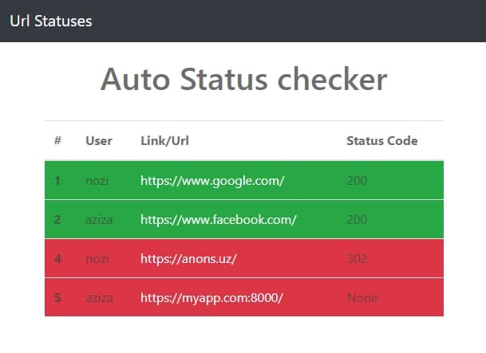

# UrlStatusChacker
Automatically url-checker django app

Run project:
1. Create env with python3 (python3 -m venv env)
2. Activate env 
3. Install all required modules from requirements.txt (_pip install -r requirements.txt_)
4. Create and run migrations
5. Launch the development server on localhost (_python manage.py runserver_)
6. Create superuser for admin and insert some data

> Application periodically checks the url status codes
 
> Urls are passed from ajax and saved in db  

The simple user interface with bootstrap 4

